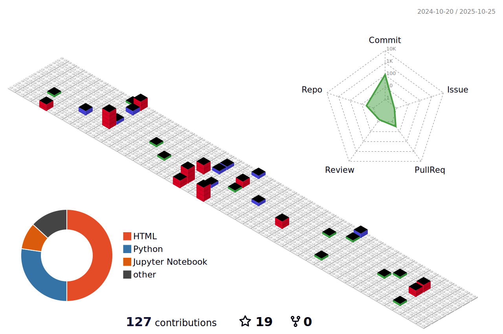

<h2 align="left">Hi there, I'm <a href="https://www.linkedin.com/in/byeonghun-kim-896831279/" target="_blank" rel="noopener noreferrer">Byeonghun Kim</a> 
  
#### About me
> **👨🏼‍🎓[Education]**
> - **Undergraduate Student(Department of AI and Big Data)** (2017.03 ~ 2021.02)
> - **Master's Student(Department of Future Convergence Technology)** (2023.09 ~ 2025.08)
---
> **🔎[Research Interest]**
> - **Computer Vision**
> - **Personalized Federated Learning**
> - **Smart city & Mobility Environments**
> - **LLM/LMM-based system advancements**
> - **Autonomous driving safety and reliability**
---
> **📃[Papers]**

> ***International Journal***
> - [Under review] **Byeonghun Kim**, Byeongjoon Noh* "Federated Learning-based Road Surveillance System in Distributed CCTV Environment: Pedestrian Fall Recognition using Spatio-Temporal Attention Networks" **Applied Intelligence**
> - [Under review] **Byeonghun Kim**, Byeongjoon Noh* "Pedestrian Collapse Detection Method with Federated Spatio-Temporal Transformers in Distributed Road Surveillance Systems" **IEEE Transactins of Intelligent Transportation Systems**
> - **Byeonghun Kim**, Byeongjoon Noh*, and Known Song* "Method on Efficient Operation of Multiple Models for Vision-based In-Flight Risky Behavior Recognition in UAM Safety and Security", **Journal of Advanced Transportation**

> ***International Conference***
> - **Byeonghun Kim**, Byeongjoon Noh* "FLAMe: Federated Learning with Attention Mechanism using Spatio-Temporal Keypoint Transformers for Pedestrian Fall Detection in Smart Cities" **AAAI-25**
> - **Byeonghun Kim**, Insu Jeon, Chomyong Kim, Jung-Yeon Kim, Jiyoung Woo, and Byeongjoon Noh*, "Caregiver-Child Interaction Detection Model Based on Computer Vision to Measure Social Interaction Skills of Children with Developmental Disabilities", The 6th Engineering in Biomedical and Rehabilitation & Home Conference(EBRC&HOME)

> ***Domestic Conference***
> - **김병훈**, 노병준*, "분산 CCTV 환경에서의 연합학습 기반 도로 감시 시스템: 시공간 키포인트 트랜스포머 네트워크를 이용한 보행자 쓰러짐 감지" 2024 한국 ITS 학회 추계학술대회 논문집
> - **김병훈**, 노병준*, "무인 드론 기체 내 승객 위험 행동 감지를 위한 다중 비전 모델 스케줄링 시스템", 2024 한국 ITS 학회 춘계학술대회 논문집
---
> **🏆[Awards]**

> ***2020***

> **김병훈**, 권도윤, 박성아, 박명석 "한국 음식 이미지 분류를 위한 CNN(ResNet50, ResNet101) 기반 모델 개발" 2020 데이터 크리에이터 캠프 (과학기술정보통신부, NIA, K-ICT) : **대상**
> **김병훈**, 유성주 "라즈베리파이와 기침데이터를 이용한 코로나 발병예측" AI·빅데이터학과 데이터 분석 및 개발 대회 (순천향대학교 2020) : **대상**
---

  
Languages and Tools
&nbsp;
  
  <code></code>
  <code></code>
  <code></code>
  <code></code>
  <code></code>
  <code></code>
  <code></code>
  <code></code>
  <code></code>
  <code></code>
  <code></code>
  <code></code>
  <code></code>

